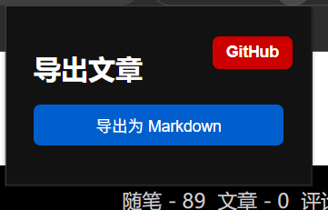

作为写作者或内容搬运爱好者，经常需要将网页文章内容导出成 Markdown 格式，方便后续编辑、备份和发布。市面上很多工具功能单一，或者仅支持某个平台，使用起来不够方便。

为此，我开发了一款 Chrome 浏览器插件 —— 文章下载器，支持一键导出知乎、CSDN、微信公众号、博客园等多个主流图文平台的文章内容为 Markdown 文件，简洁高效，完全开源，欢迎大家试用和反馈！



## 插件主要功能
支持知乎、CSDN、微信公众号和博客园文章内容抓取

自动提取标题、正文、图片、代码块等内容，转换成标准 Markdown 格式

支持点击弹窗按钮导出，也支持右键菜单快速导出

纯前端实现，无需登录，无需后端，安全又隐私

开源免费，代码托管于 GitHub，欢迎参与贡献

## 为什么选择 Markdown？
Markdown 格式是一种轻量级标记语言，兼容性好，适合写作和二次编辑。导出的 Markdown 文件可以直接用于个人博客、GitHub 仓库、笔记软件（如 Notion、Obsidian）等，非常方便。

## 安装和使用
克隆或下载插件代码：

GitHub 地址：https://github.com/yang-shuohao/markdown-export

在 Chrome 浏览器中打开 chrome://extensions/，打开右上角的“开发者模式”，点击“加载已解压的扩展程序”，选择插件源码文件夹。

打开支持的网站文章页面，比如知乎、CSDN、微信公众号、博客园。

点击浏览器工具栏的插件按钮，在弹出的窗口中点击“导出为 Markdown”即可保存文章。

或者在页面空白处点击右键，选择“导出为 Markdown”快捷菜单快速导出。

## 支持的平台示例
知乎：https://www.zhihu.com/question/xxxxxx

CSDN：https://blog.csdn.net/xxxx/article/details/xxxxxx

微信公众号：https://mp.weixin.qq.com/s/xxxxxx

博客园：https://www.cnblogs.com/xxxx/p/xxxxxx.html

## 部分实现原理
插件通过注入内容脚本，定位页面中文章的 DOM 节点，遍历包含文字、标题、图片、代码的标签，转换为对应的 Markdown 语法：

普通文本和标题转换为 Markdown 标题和段落

图片提取 src 地址，转换为markdown图片格式

代码块包裹在三个反引号 ```

文章标题作为文件名，替换非法字符避免保存失败

这种做法轻量且兼容多平台页面结构差异，后续也可以拓展支持更多网站。

## 未来计划
支持更多图文自媒体平台，比如简书、博客园等

增加自动分页抓取长文章

支持导出为 PDF 等多种格式

优化导出体验，支持进度条和多选文章导出

## 结语
如果你也需要高效地保存和整理网页文章，不妨试试这个免费开源的插件，欢迎给我提建议、提 PR！

GitHub 地址：https://github.com/yang-shuohao/markdown-export